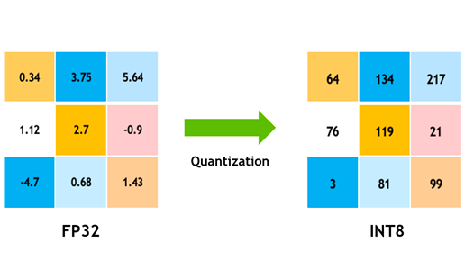
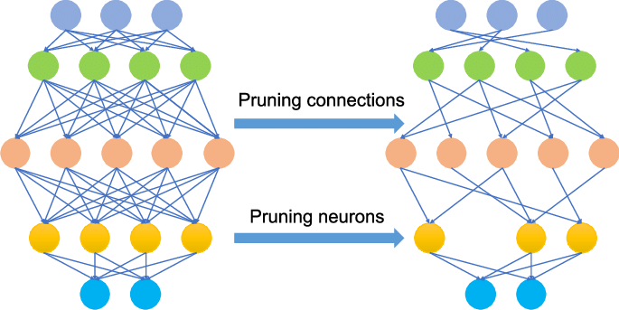

# Pedestrian Detection on Raspberry PI

This MLOps project focuses on training and deploying a pedestrian detection model. The objective is to train a highly accurate machine learning model for this task and integrate it into a Raspberry Pi 3B for edge computing applications.

The project demonstrates the end-to-end machine learning lifecycle, including:

- Model Training: Building and training a pedestrian detection model using state-of-the-art techniques.
- Optimization: Adapting the model for efficient deployment on resource-constrained devices.
- Deployment: Embedding the model on a Raspberry Pi 3B, enabling real-time pedestrian detection on the edge.


Authors:
- Sami Carret (sami.carret@epita.fr)
- Florine Kieraga (florine.kieraga@epita.fr)
- Samy Amine (samy.amine@epita.fr)

## Setup

This project has many features that may be tested independently. First of all, you may need to instll the dataset. You can find it at the following URL:


This project is modular, with multiple features that can be tested independently. Before getting started, ensure you have the required dataset installed at the root of the project. You can download the dataset from the following URL:
[City Person dataset](https://www.kaggle.com/datasets/samyamine23/cityperson/data)


You can create a virtual environement and install the required dependencies:

```bash
pip install -r requirements.txt
```

Then, you may proceed to train the YOLOv8n model for the pedestrian detection task. Simply run the Python script named ```train-model.py```:

```bash
python training/train-model.py
```

Once training is complete, you can initiate live detection using either the Raspberry Pi 3B camera or your local webcam:

- With the Raspberry:

```bash
python detection/detection.py --input_model training_output/runs/detect/train/weights/best.pt
```

- With the local webcam:
```bash
python detection/detection_local.py --input_model training_output/runs/detect/train/weights/best.pt
```

Next, you can proceed with the following sections independently to test various aspects of the project.


## Quantization



Quantization is an optimization technique that reduces the precision of a machine learning model's weights, such as converting them from FP32 encoding to INT8 encoding. To apply this technique using our implementation, execute the following command:

```bash
python quantization/quantization.py --input_model training_output/runs/detect/train/weights/best.pt --quantized_path quantized.onnx
```

You can then initiate the live detection script using the quantized model:

- With the Raspberry:

```bash
python detection/detection.py --input_model quantization/quantized.onnx
```

- With the local webcam:
```bash
python detection/detection_local.py --input_model quantization/quantized.onnx
```

## Pruning



Pruning is an optimization technique that involves removing the least important weights and/or biases from a model to reduce its inference time and storage requirements. To apply our implementation of this technique, run the following command:

```bash
python pruning/pruning.py --input_model training_output/runs/detect/train/weights/best.pt --output_path pruned.pt
```

You can then initiate the live detection script using the pruned model:

- With the Raspberry:

```bash
python detection/detection.py --input_model pruning/pruned.pt
```

- With the local webcam:
```bash
python detection/detection_local.py --input_model pruning/pruned.pt
```
